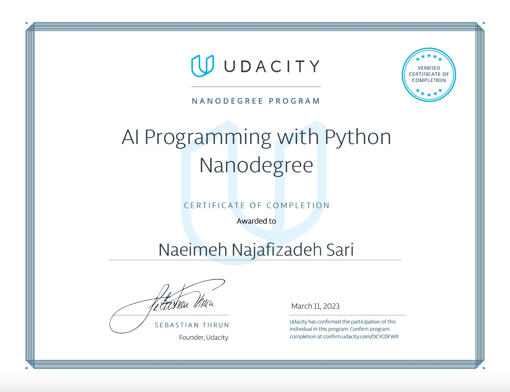

# My Portfolio

This repository contains my portfolio, which showcases my skills and experience in AI applications with Python.

## Projects

### Project 1: [Use a Pre-trained Image Classifier to Identify Dog Breeds](https://github.com/naeimehnajafi/Udacity_AI_portfolio/tree/810617298f7cf922aaadd5690bbbd40376189e97/ImageClassificationCNN)

The goal of this project is to improve my programming skills using Python. This is the first project towards the Udacity nanodegree program on AI programming with Python (winter cohort). In this project, I will use a created image classifier to identify dog breeds. The focus is on Python and not on the actual classifier. For the second project, I will be designing the image classifier myself.I have provided a brief description of the project and the TODOs in the project's readme file. For the final results and the real-time result running in gif format, scroll down. The total run time is 55 seconds, so be sure to watch until the end.

### Project 2: [Create your own Image Classifier](https://github.com/naeimehnajafi/Udacity_AI_portfolio/tree/810617298f7cf922aaadd5690bbbd40376189e97/Create_your_own_image_classifier)

Project code for Udacity's AI Programming with Python Nanodegree program. In this project, I first developed code for an image classifier built with PyTorch, then convert it into a command line application.

## Certificates

